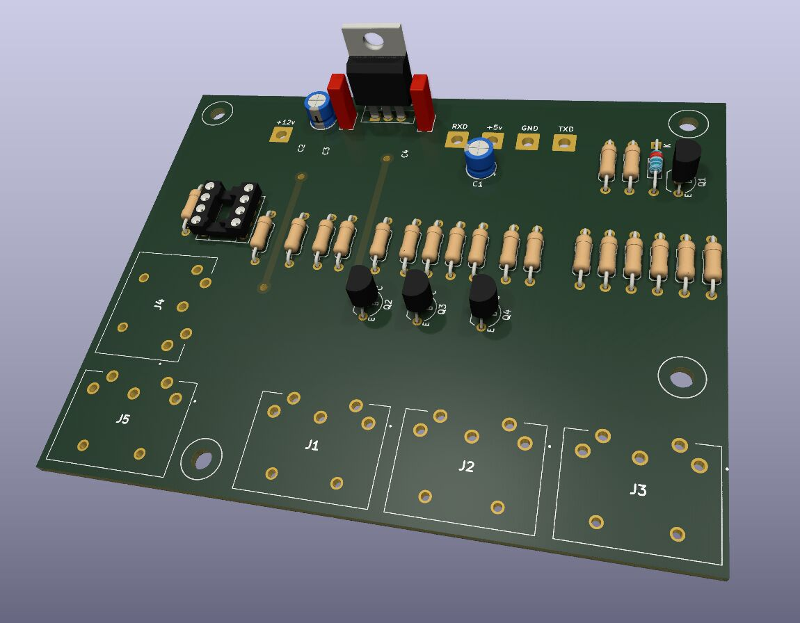

# SAF-AmigaMIDI-CNC

This version is for making the midi interface at home.

It is single sided with two jumper wires (the wires is shown as the top copper
layer) there are also a optional voltage regulator spot.

It is also made to fit on a 100✕80mm, Half a Eurocard.
