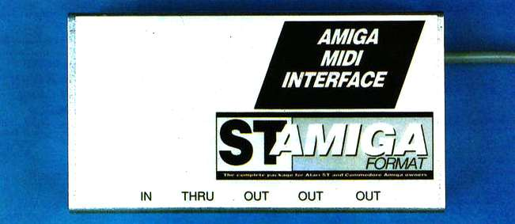

# SAF-AmigaMIDI

## Not verified

A somewhat faithful recreation of the Amiga MIDI interface from
"ST Amiga Format" issue 5

In the folder [CNC-version/](CNC-version/) is a mainly single sided design that
is targeting toner transfer, home photolithography and CNC milling. There are a
place for a optional L7805 voltage regulator. There are only two jumper wires in
this design that is shown as upper PCB layer.

In the folder [PCB-house/](PCB-house/) is a experimental version with various
upgrades while still using discreet components and a 6n138.

Original article [Documents/SAF-AmigaMIDI.pdf](Documents/SAF-AmigaMIDI.pdf)
